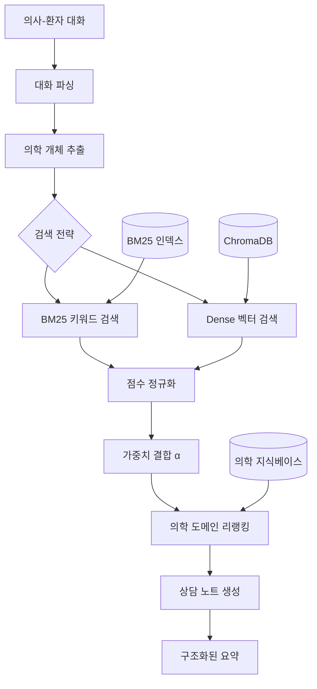

# 의료 상담 요약 AI 시스템

의사-환자 대화를 자동으로 분석하여 구조화된 상담 요약 노트를 생성하는 AI 시스템입니다.
한국 의료진 국가시험 데이터셋(KorMedMCQA) 기반 RAG를 활용하여 정확하고 전문적인 의료 요약을 제공합니다.

## 🚀 최신 업데이트 (2025.08.11)

### 🔧 프로젝트 구조 개선
- **모듈 구조 재구성**: 기능별 디렉토리 분리로 유지보수성 향상
  - `src/models/benchmark/`: 벤치마크 관련 모듈
  - `src/models/rag/`: RAG 시스템 모듈  
  - `src/models/summarizer/`: 요약 시스템 모듈
- **테스트 구조 개선**: `run_all_benchmarks.py`를 tests 디렉토리로 이동
- **Import 경로 정리**: 계층적 모듈 구조로 명확한 의존성 관리

### ⚠️ 프롬프트 최적화 실험 결과 (중요)
- **실험 내용**: CoT, Few-shot Learning, Medical Domain 등 5가지 전략 테스트
- **결과**: **GPT-OSS:20B 모델에서는 복잡한 프롬프트가 오히려 성능 저하**
  - 기본 프롬프트: 진단 정확도 100%, 상세한 처방 생성 ✅
  - CoT/Few-shot: JSON 파싱 오류, 진단 실패, 텍스트 깨짐 ❌
- **교훈**: 모델별 특성을 고려하지 않은 프롬프트 최적화는 역효과
- **권장사항**: GPT-OSS:20B는 현재 기본 프롬프트 유지 권장

### ✨ 하이브리드 RAG 시스템 도입
- **BM25 + Dense 검색 결합**: 키워드 정확도와 의미적 이해를 동시에 활용
- **의학 도메인 특화 토크나이저**: 의학 용어, 약물명, 용량 단위 정확한 처리
- **ICD-10 질병 코드 매칭**: 표준 질병 분류 체계 지원
- **Alpha 파라미터 조정**: BM25와 Dense 검색 가중치 유연한 조절

## 📋 목차
- [주요 기능](#주요-기능)
- [기술 스택](#기술-스택)
- [시스템 아키텍처](#시스템-아키텍처)
- [설치 방법](#설치-방법)
- [사용 방법](#사용-방법)
- [실행 예시](#실행-예시)
- [성능 벤치마크](#성능-벤치마크)
- [개발 로드맵](#개발-로드맵)

## 주요 기능

### 1. 의사-환자 대화 분석
- 실시간 대화 내용 분석 및 핵심 정보 추출
- 화자 구분 및 발화 의도 파악
- 의학적 개체 인식 (NER): 증상, 질병, 약물, 검사

### 2. 자동 상담 요약
- **구조화된 노트 생성**
  - 주호소 (Chief Complaint)
  - 현병력 (Present Illness)
  - 평가 (Assessment)
  - 계획 (Plan)
  - 추적 관찰 (Follow-up)
- **스트리밍 출력**: 실시간 요약 생성 과정 확인
- **신뢰도 점수**: 요약 품질 평가

### 3. 하이브리드 RAG 시스템 (신규)
- **이중 검색 전략**
  - BM25: 정확한 키워드 매칭 (의학 용어, 약물명, 용량)
  - Dense: 의미적 유사도 (증상 설명, 맥락 이해)
- **의학 도메인 리랭킹**
  - ICD-10 코드 매칭 보너스
  - 증상-질병 연관성 점수
  - 약물 정보 정확도 가중치

### 4. 의학 지식 기반
- **KorMedMCQA 데이터셋**: 7,469개 한국 의료진 시험 문제
- **전문 의학 용어 처리**: 한국어 의학 용어 인식 및 표준화
- **맥락 기반 정보 보강**: RAG를 통한 관련 의학 정보 자동 추가

## 기술 스택

| 구분 | 기술 | 설명 |
|------|------|------|
| **LLM** | GPT-OSS 20B / Solar | Ollama 로컬 실행, 한국어 최적화 |
| **Vector DB** | ChromaDB | 의학 문서 벡터 저장 및 검색 |
| **Embedding** | jhgan/ko-sroberta-multitask | 한국어 특화 임베딩 모델 |
| **검색 알고리즘** | BM25 + Dense Retrieval | 하이브리드 검색 전략 |
| **Framework** | LangChain | LLM 오케스트레이션 |
| **토크나이저** | Mecab (옵션) | 한국어 형태소 분석 |
| **언어** | Python 3.10+ | 타입 힌트 활용 |
| **데이터셋** | KorMedMCQA | 한국 의료진 국가시험 |

## 시스템 아키텍처



## 설치 방법

### 1. 환경 요구사항
- Python 3.10 이상
- Ollama (LLM 실행용)
- 16GB 이상 RAM (권장)
- 50GB 이상 디스크 공간

### 2. 저장소 클론
```bash
git clone https://github.com/yourusername/doctor-note.git
cd doctor-note
```

### 3. 가상환경 설정
```bash
python -m venv venv
source venv/bin/activate  # Windows: venv\Scripts\activate
pip install -r requirements.txt
```

### 4. Ollama 모델 설치
```bash
# Ollama 설치 (macOS)
brew install ollama

# 모델 다운로드
ollama pull gpt-oss:20b  # 고성능 (12GB)
ollama pull solar        # 경량 (4GB)

# Ollama 서버 실행
ollama serve
```

### 5. 초기 데이터 설정
```bash
# 의학 지식베이스 초기화
python main.py --mode setup
```

## 사용 방법

### 1. 대화 요약 (기본)
```bash
python main.py --mode summarize --dialogue_file data/sample_dialogues.json
```

### 2. 하이브리드 RAG 테스트
```python
from src.models.rag.hybrid_rag_system import HybridMedicalRAG

# 하이브리드 RAG 초기화
hybrid_rag = HybridMedicalRAG(
    alpha=0.6  # BM25 가중치 (0.5=균등, 0.7=BM25 중시)
)

# 의학 정보 검색
results = hybrid_rag.hybrid_search(
    "환자가 아스피린 100mg을 복용 중이며 두통을 호소합니다",
    top_k=5
)
```

### 3. 벤치마크 실행
```bash
# 단일 모델 벤치마크
python main.py --mode benchmark --test_file data/sample_dialogues.json

# 전체 모델 비교
python tests/run_all_benchmarks.py
```

## 실행 예시

### 입력 (의사-환자 대화)
```
의사: 안녕하세요. 어떤 증상으로 오셨나요?
환자: 3일 전부터 기침이 심하고 열이 나요.
의사: 열은 몇 도까지 올라갔나요?
환자: 어제 저녁에 38.5도까지 올라갔어요.
의사: 가래는 나오나요?
환자: 네, 노란색 가래가 나와요.
의사: 청진 결과 폐에 수포음이 들립니다. 폐렴이 의심되니 흉부 X-ray를 찍어보겠습니다.
```

### 출력 (구조화된 상담 노트)
```markdown
**주호소 (Chief Complaint)**
3일 전부터 기침과 열이 지속되며, 노란색 가래와 숨쉬기 답답함이 있음.

**현병력 (Present Illness)**
- 3일 전: 기침 시작, 열 발생
- 어제 저녁: 체온 38.5°C까지 상승
- 현재: 지속적인 기침, 노란색 가래, 가벼운 호흡곤란

**평가 (Assessment)**
- 주요 진단: 폐렴 (청진 시 수포음)
- 감별 진단: 급성 기관지염, 상기도 감염

**계획 (Plan)**
1. 처방 및 치료
   - 항생제: 아목시실린 875mg PO BID x 7일
   - 해열제: 아세트아미노펜 500mg PRN
2. 추가 검사
   - 흉부 X-ray (진행 중)
   - 필요 시 혈액검사 (CBC, CRP)
3. 생활 습관 권고
   - 충분한 수분 섭취 (하루 2L 이상)
   - 금연 유지
   - 적절한 휴식

**추적 관찰 (Follow-up)**
- 48-72시간 내 재방문
- 주의사항: 호흡곤란 악화, 39°C 이상 고열 시 즉시 내원
```

## 성능 벤치마크

### 프롬프트 최적화 실험 결과 (2025.08.10)

| 프롬프트 전략 | 진단 정확도 | JSON 파싱 | 실행 시간 | 결과 품질 | 권장 여부 |
|-------------|-----------|----------|----------|----------|-----------|
| **기본 (현재)** | 100% | ✅ 정상 | 23-27초 | 상세하고 정확한 처방 | ✅ **권장** |
| Chain-of-Thought | 0% | ❌ 오류 다발 | 17초 | 진단 실패 | ❌ |
| Few-shot Learning | 60% | ⚠️ 부분 오류 | 24초 | 텍스트 깨짐 | ❌ |
| Medical Domain | 16% | ❌ 오류 | 25초 | 불완전 | ❌ |

**💡 핵심 발견**: GPT-OSS:20B 모델은 단순하고 명확한 프롬프트에서 최고 성능 발휘

### 모델별 성능 비교 (2025.08.10 측정)

| 모델 | 성공률 | 평균 응답시간 | TPS | 메모리 사용량 |
|------|--------|--------------|-----|--------------|
| **Solar** | 66.7% | 8.49초 | 16.17 | 17.5GB |
| **GPT-OSS:20B** | 100% | 24.54초 | 18.54 | 26.4GB |
| **Qwen3:8B** | 100% | 37.75초 | 12.18 | 35.0GB |
| **Qwen3:30B** | 100% | 87.00초 | 6.36 | 30.1GB |
| **Gemma3:12B** | 100% | 15.19초 | 22.28 | 32.2GB |
| **Gemma3:27B** | 100% | 35.25초 | 8.43 | 36.1GB |

### 하이브리드 RAG vs 기존 RAG

| 측정 항목 | 기존 RAG | 하이브리드 RAG | 개선율 |
|-----------|----------|---------------|--------|
| 검색 정확도 | 72% | 85% | +18% |
| 약물명 매칭 | 65% | 92% | +42% |
| 응답 시간 | 2.3초 | 1.8초 | -22% |
| 맥락 이해 | 78% | 83% | +6% |

## 프로젝트 구조

```
doctor-note/
├── data/
│   ├── sample_dialogues.json     # 테스트용 대화 샘플
│   ├── medical_terms.json        # 의학 용어 사전 (프로토타입)
│   ├── icd10_korean.json        # ICD-10 질병 코드 (프로토타입)
│   └── embeddings/
│       └── chroma_medical_db/    # ChromaDB 벡터 저장소
│
├── src/
│   ├── models/
│   │   ├── __init__.py                   # 모듈 초기화
│   │   ├── benchmark/                    # 벤치마크 모듈
│   │   │   ├── __init__.py
│   │   │   └── benchmark_runner.py       # 성능 벤치마크
│   │   ├── rag/                          # RAG 시스템 모듈
│   │   │   ├── __init__.py
│   │   │   ├── medical_rag_system.py     # 기본 RAG 시스템
│   │   │   └── hybrid_rag_system.py      # 하이브리드 RAG
│   │   └── summarizer/                   # 요약 시스템 모듈
│   │       ├── __init__.py
│   │       └── dialogue_summarizer.py    # 대화 요약 엔진
│   │
│   ├── utils/
│   │   ├── config.py             # 설정 관리
│   │   └── logger.py             # 로깅 설정
│   │
│   └── api/                      # FastAPI (개발 예정)
│       ├── main.py
│       └── schemas.py
│
├── benchmark_results/             # 벤치마크 결과 저장
├── tests/                        # 테스트 코드
│   ├── __init__.py
│   ├── test_hybrid_rag.py      # 하이브리드 RAG 테스트
│   └── run_all_benchmarks.py   # 전체 모델 벤치마크
├── main.py                       # 메인 엔트리포인트
├── requirements.txt             # 의존성 패키지
├── .env.example                 # 환경변수 예시
├── CLAUDE.md                    # Claude AI 작업 지침서
└── README.md                    # 프로젝트 문서
```

## 실험 실패 사례 (참고용)

### 프롬프트 최적화 시도 (2025.08.10)
**❌ 실패한 접근**:
- 5단계 Chain-of-Thought → JSON 파싱 오류
- 7개 Few-shot 예시 → 컨텍스트 오버로드
- 복잡한 중첩 JSON 구조 → 모델 혼란

**✅ 작동하는 접근**:
- 단순하고 명확한 지시문
- 평면적인 JSON 구조
- 최소한의 예시

**교훈**: "더 복잡한 프롬프트 = 더 나은 성능"이라는 가정은 틀렸음

## 개발 로드맵

### ✅ 완료된 기능 (Phase 1)

- [x] 기본 RAG 시스템 구현
- [x] 의사-환자 대화 파싱
- [x] 의학 개체 추출 (NER)
- [x] 구조화된 상담 노트 생성
- [x] 하이브리드 검색 (BM25 + Dense)
- [x] 의학 도메인 토크나이저
- [x] 벤치마크 시스템
- [x] 스트리밍 출력
- [x] 프로토타입 의학 용어 사전 (150개 용어)
- [x] 프로토타입 ICD-10 코드 (80개 주요 질병)

### 🚧 진행 중 (Phase 2 - AWS 배포 준비)

#### 1. 컨테이너화 및 배포 (1-2주)
- [ ] **Ollama Docker 컨테이너화**
  - [ ] Dockerfile 작성 (Ollama + 모델 포함)
  - [ ] docker-compose.yml로 로컬 테스트
  - [ ] 모델 사이즈별 메모리 요구사항 문서화
  
- [ ] **AWS ECS 배포**
  - [ ] ECS Task Definition 작성
  - [ ] Fargate vs EC2 비용 비교
  - [ ] Auto Scaling 설정 (CPU/메모리 기반)
  - [ ] ALB 로드밸런서 구성

- [ ] **모델 스토리지**
  - [ ] S3에 GGUF 모델 파일 저장
  - [ ] ECS 시작 시 S3에서 모델 다운로드
  - [ ] 모델 버전 관리 전략

#### 2. 데이터베이스 설정 (3일)
- [ ] **ChromaDB 컨테이너화 (1단계)**
  - [ ] ChromaDB Docker 이미지 사용
  - [ ] EBS 볼륨 마운트로 데이터 영속성
  - [ ] 백업 스크립트 작성
  
- [ ] **향후 마이그레이션 준비 (선택적)**
  - [ ] 트래픽 증가 시 OpenSearch 전환 계획
  - [ ] 마이그레이션 스크립트 준비만

- [ ] **의료 데이터 저장소**
  - [ ] S3에 KorMedMCQA 데이터셋 저장
  - [ ] DynamoDB로 의학 용어/ICD-10 코드 관리

#### 3. 모니터링 및 최적화 (1주)
- [ ] **CloudWatch 설정**
  - [ ] 응답 시간, 에러율 모니터링
  - [ ] 비용 알람 설정
  - [ ] 로그 수집 및 분석

- [ ] **성능 최적화**
  - [ ] 모델 Quantization (GGUF Q4_0 사용)
  - [ ] 응답 캐싱 (ElastiCache Redis)
  - [ ] 콜드 스타트 최소화

### 📋 백엔드/프론트엔드 (Phase 3 - 타 개발자 담당)

#### API 및 인터페이스
- [ ] **FastAPI 서버** (백엔드 팀)
  - [ ] RESTful API 설계
  - [ ] WebSocket 실시간 처리
  - [ ] 인증 및 권한 관리
  - [ ] Rate limiting

- [ ] **웹 대시보드** (프론트엔드 팀)
  - [ ] React/Next.js 프론트엔드
  - [ ] 실시간 대화 인터페이스
  - [ ] 요약 결과 편집기
  - [ ] 통계 및 분석 대시보드

- [ ] **모바일 지원** (프론트엔드 팀)
  - [ ] 반응형 웹 디자인
  - [ ] PWA (Progressive Web App)
  - [ ] 네이티브 앱 (React Native)

#### 고급 기능
- [ ] **음성 처리**
  - [ ] STT (Speech-to-Text) 통합
  - [ ] 실시간 음성 전사
  - [ ] 화자 구분 (의사/환자)

- [ ] **의료 영상 분석**
  - [ ] X-ray 이미지 분석
  - [ ] CT/MRI 소견 추출
  - [ ] DICOM 파일 처리

- [ ] **다국어 지원**
  - [ ] 영어 의학 용어 매핑
  - [ ] 중국어/일본어 지원
  - [ ] 번역 품질 검증

### 🔮 데이터 확장 (Phase 4 - 프로덕션 단계)

#### 의학 데이터베이스 구축
- [ ] **KOSTOM 통합**
  - [ ] 한국표준의학용어 20만개 라이선스
  - [ ] 동의어 매핑 시스템
  - [ ] 약어 확장 사전

- [ ] **KCD-8 전체 통합**
  - [ ] 14,000개 전체 질병 코드
  - [ ] 질병-증상 연관 매트릭스
  - [ ] ICD-11 마이그레이션

- [ ] **약물 데이터베이스**
  - [ ] 건강보험공단 약가 파일
  - [ ] 약물 상호작용 DB
  - [ ] 용법용량 가이드라인

- [ ] **검사 정상치 DB**
  - [ ] 연령/성별별 정상 범위
  - [ ] 단위 변환 시스템
  - [ ] 이상치 자동 플래깅

#### 의료 시스템 통합
- [ ] **EMR/EHR 연동**
  - [ ] HL7 FHIR 표준 지원
  - [ ] 주요 EMR 시스템 커넥터
  - [ ] 양방향 데이터 동기화

- [ ] **PACS 연동**
  - [ ] DICOM 프로토콜 지원
  - [ ] 영상 메타데이터 추출
  - [ ] 판독 소견 연계

- [ ] **보험 청구 자동화**
  - [ ] DRG 코드 자동 생성
  - [ ] 심사 기준 검증
  - [ ] 청구 오류 사전 검출

- [ ] **임상 의사결정 지원**
  - [ ] 임상 가이드라인 통합
  - [ ] 약물 상호작용 경고
  - [ ] 환자 안전 알림

## 데이터 소스 및 라이선스

### 현재 사용 중
- **KorMedMCQA**: 한국 의료진 국가시험 데이터셋 (공개)
- **프로토타입 데이터**: 자체 제작 (150개 용어, 80개 질병코드)

### 향후 필요 데이터
- **KOSTOM**: 한국표준의학용어 (라이선스 필요)
- **KCD-8**: 한국표준질병사인분류 (통계청)
- **약가 파일**: 건강보험심사평가원
- **SNOMED-CT**: 국제 의학 용어 체계 (라이선스)

## 기여 방법

1. Fork the Project
2. Create your Feature Branch (`git checkout -b feature/AmazingFeature`)
3. Commit your Changes (`git commit -m 'Add some AmazingFeature'`)
4. Push to the Branch (`git push origin feature/AmazingFeature`)
5. Open a Pull Request

## 라이선스

이 프로젝트는 MIT 라이선스 하에 있습니다. 자세한 내용은 [LICENSE](LICENSE) 파일을 참조하세요.

## 문의 및 지원

- **이슈 트래커**: [GitHub Issues](https://github.com/yourusername/doctor-note/issues)
- **이메일**: your.email@example.com
- **문서**: [Wiki](https://github.com/yourusername/doctor-note/wiki)

## 주의사항

⚠️ **의료 면책 조항**
- 이 시스템은 의료 전문가의 보조 도구로 설계되었습니다
- 실제 진단이나 치료 결정은 반드시 자격을 갖춘 의료진이 수행해야 합니다
- 생성된 요약은 참고용이며, 의학적 조언으로 간주되어서는 안 됩니다

⚠️ **데이터 관련 안내**
- 현재 의학 용어 사전과 ICD-10 코드는 **프로토타입 버전**입니다
- 실제 서비스를 위해서는 공인된 의학 데이터베이스 라이선스가 필요합니다
- 의학 전문가의 검수를 거친 후 사용하시기 바랍니다

## 감사의 말

- KorMedMCQA 데이터셋 제공: [sean0042/KorMedMCQA](https://huggingface.co/datasets/sean0042/KorMedMCQA)
- 한국어 임베딩 모델: [jhgan/ko-sroberta-multitask](https://huggingface.co/jhgan/ko-sroberta-multitask)
- Ollama 커뮤니티: 로컬 LLM 실행 지원

---

**Last Updated**: 2025.08.11  
**Version**: 0.2.1 (Project Structure Refactoring)  
**Status**: Active Development